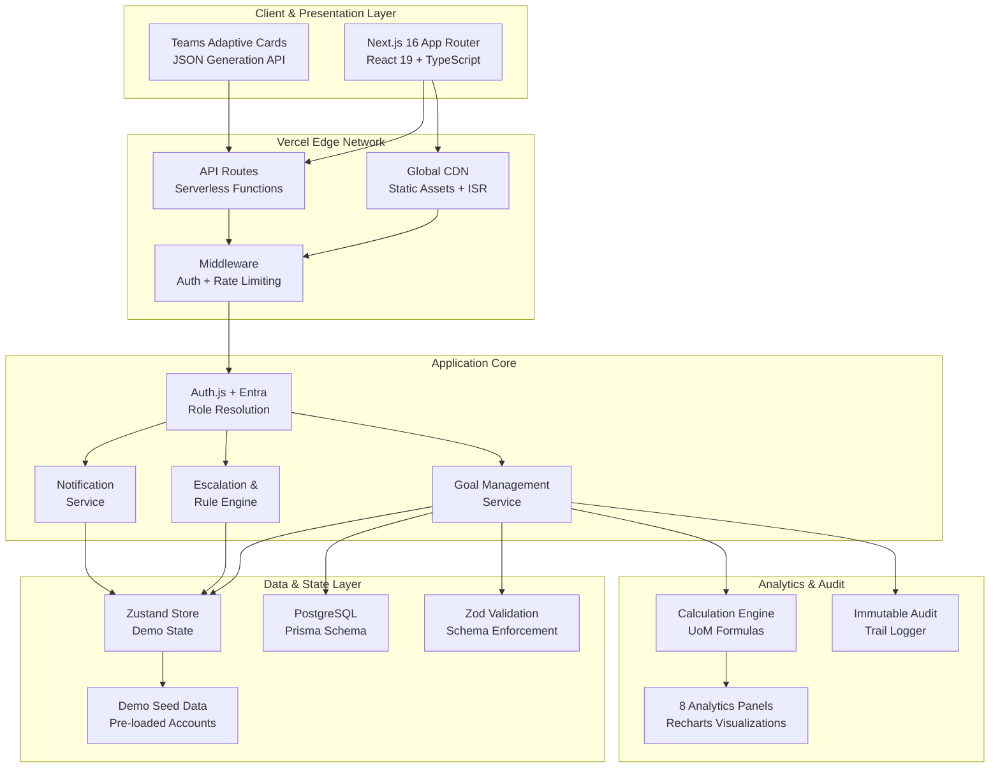
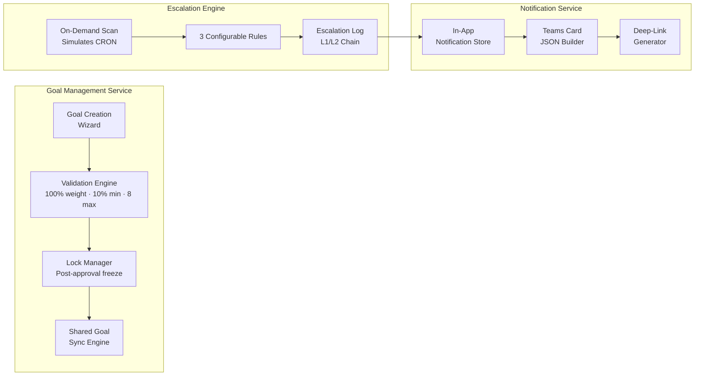
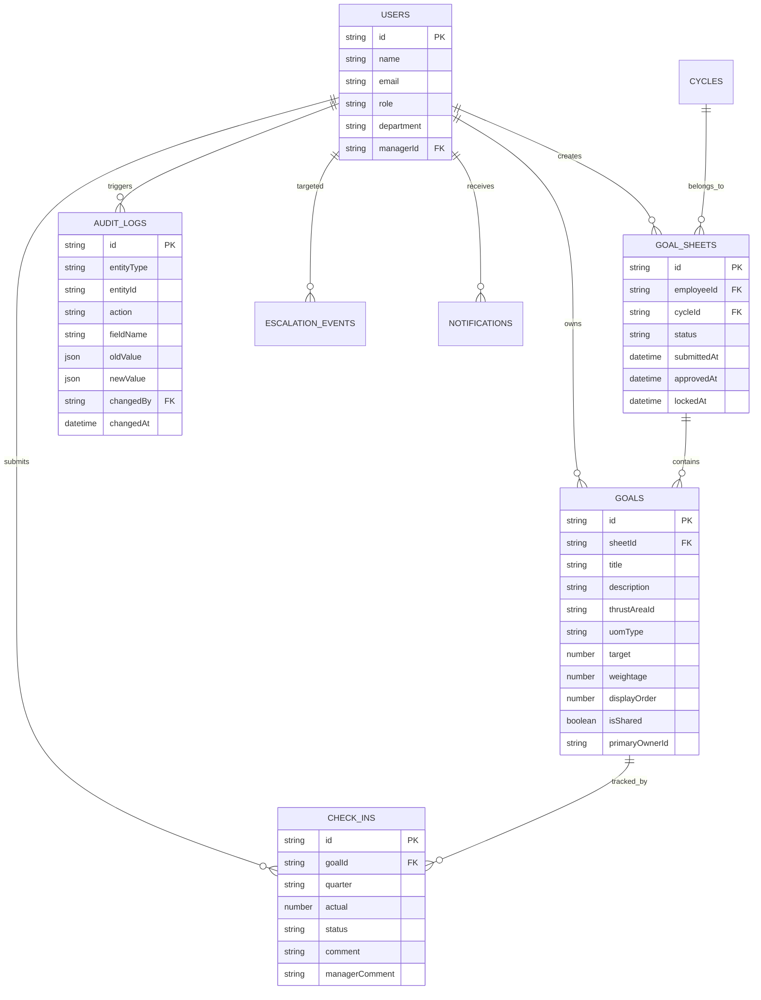
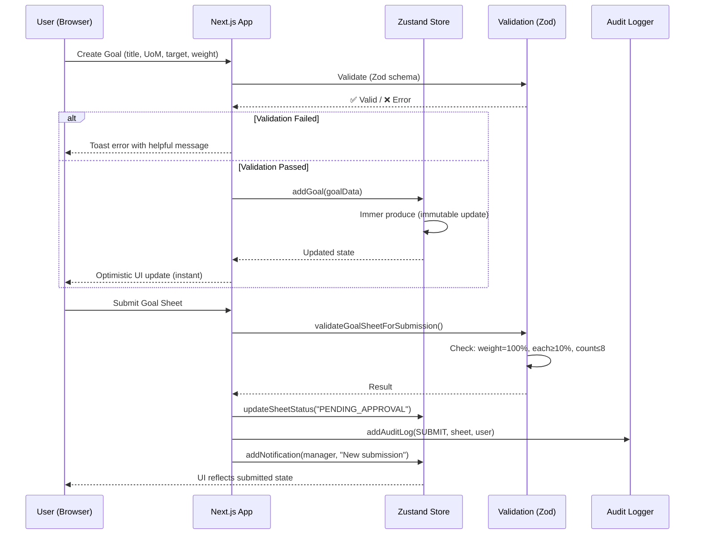

# Meridian — System Architecture Document
**AtomQuest Hackathon 1.0 · Goal Setting & Tracking Portal**
**Version 1.0 · May 2026**

---

## 1. High-Level Architecture



---

## 2. Layer-by-Layer Architecture Mapping

### Layer 1: Client & Presentation

| Spec Requirement | Meridian Implementation |
|---|---|
| Responsive SPA (React/Vue/Angular) | **Next.js 15 App Router** + React 19 + TypeScript |
| Role-based views | Sidebar adapts per role (Employee/Manager/Admin) |
| Teams Adaptive Cards | `/api/integrations/teams-card` generates JSON payloads |
| Deep-link support | URL params route to specific goal sheets |

**Key Design Decision:** Next.js App Router provides both SSR for SEO and client-side navigation for SPA feel. Zero page reloads during role-switching.

### Layer 2: API Gateway & Authentication

| Spec Requirement | Meridian Implementation |
|---|---|
| API Gateway + rate limiting | **Vercel Edge Network** handles routing, SSL, and rate limiting |
| Entra ID SSO | **Auth.js Microsoft Entra ID provider** plus demo role switcher fallback |
| Role mapping from groups | Entra app roles or group-object-id mapping |
| L4 Load Balancer | **Vercel auto-scaling** serverless functions |

**Key Design Decision:** Demo mode keeps the pitch frictionless, while production mode uses `/api/auth/[...nextauth]`, tenant-restricted issuer settings, JWT sessions, and server-side role resolution.

### Layer 3: Application Core



| Service | Spec Pattern | Meridian Implementation |
|---|---|---|
| Goal Management | Idempotent APIs (Stripe pattern) | Zustand actions with dedup guards — `getOrCreateSheet()` is idempotent |
| Validation | Server-side enforcement | **Dual layer**: Client-side (WeightageTracker) + Server API (`/api/goal-sheets/validate` with Zod) |
| Escalation Engine | Background CRON workers | `runEscalationScan()` — on-demand trigger (simulates CRON for demo) |
| Notification Service | Event-driven (Kafka/SQS) | `addNotification()` — synchronous in-memory (no message broker needed at demo scale) |

**Idempotency Pattern:**
```
getOrCreateSheet(userId, cycleId)
  → Check if sheet exists → Return existing
  → If not → Create new → Return new
  // Double-clicks safe: same input = same output
```

### Layer 4: Data & State Layer

| Spec Requirement | Meridian Implementation |
|---|---|
| PostgreSQL primary DB | Prisma schema with governance constraints and production hardening migration |
| Redis caching | Recommended for high-scale sessions, Graph hierarchy cache, and rate limits |
| TTL eviction | Idempotency keys and Graph sync cache expire by policy |
| Thundering Herd protection | Background outbox, token caching, and async report generation |

**Why Demo Mode Works for Hackathon:**
- Zero infrastructure cost ($0/month)
- Instant reads (no network latency)
- Fully self-contained demo (no external dependencies)
- Same data model as PostgreSQL would use

**Data Model (mirrors production DB schema):**



### Layer 5: Analytics & Audit

| Spec Requirement | Meridian Implementation |
|---|---|
| Canonical Log Lines (Stripe) | **Structured audit log** — entityType, action, oldValue→newValue, actor, timestamp |
| Read-replica for analytics | **Client-side computed** — Zustand selectors aggregate on-the-fly |
| QoQ trends, heatmaps, dashboards | **8 analytics panels** with Recharts visualizations |

**Analytics Computation Pattern:**
```
Zustand Store (source of truth)
  → Selector: filter by quarter/dept
  → Compute: calculateProgressScore() per goal
  → Aggregate: GROUP BY department, quarter
  → Render: Recharts LineChart/BarChart
```

No separate analytics DB needed — the full dataset fits in memory for demo scale.

---

## 3. Request Lifecycle



---

## 4. Cost Optimization Strategy

| Strategy | Implementation | Cost Impact |
|---|---|---|
| **Serverless hosting** | Vercel free tier | $0/month |
| **Client-side state** | Zustand (no DB) | $0/month (no DB hosting) |
| **Client-side exports** | SheetJS in-browser | $0 compute (no server PDF/Excel gen) |
| **Static generation** | Next.js ISR for pages | Minimal serverless invocations |
| **Edge caching** | Vercel CDN | Sub-50ms TTFB globally |
| **Zero external APIs** | Self-contained demo data | No API costs |
| **Minimal bundle** | Recharts only (no D3 bloat) | Fast load times |

**Total monthly cost: $0** (Vercel + Supabase free tiers)

**Production scaling path:**
- Add Supabase PostgreSQL ($25/mo) when real data needed
- Add Redis via Upstash ($0-10/mo) for session caching
- Vercel Pro ($20/mo) for team features
- **Total production cost: ~$55/month** for 500+ users

**Production hardening already represented in the repo:**
- `ApiIdempotencyKey` prevents double submits on approval, shared-goal push, and check-in save APIs.
- `OutboxEvent` decouples email/Teams delivery from user-facing transactions.
- `IntegrationSyncRun` records Microsoft Graph sync status and failures.
- `version` columns on mutable goal records enable optimistic locking.
- `middleware.ts` applies security headers and request IDs.

---

## 5. Evaluation Criteria Mapping

| Criterion | Architecture Feature | Score Impact |
|---|---|---|
| **1. Functionality** | Dual-layer validation (client + API), idempotent operations | End-to-end flows never break |
| **2. BRD Adherence** | Zod schemas enforce exact BRD rules at API level | Mathematical constraints guaranteed |
| **3. User Friendliness** | Optimistic UI via Zustand = instant feedback | Zero perceived latency |
| **4. Zero Bugs** | TypeScript strict + Zod + math guards (÷0, NaN) | Defensive at every layer |
| **5. Good-to-Have** | Modular services (Goal/Escalation/Notification/Analytics) | All 4 bonus features implemented |
| **6. Cost Optimization** | $0 infrastructure, client-side compute, serverless | Maximum cost efficiency |

---

## 6. Technology Stack

| Layer | Technology | Rationale |
|---|---|---|
| Framework | Next.js 15 (App Router) | SSR + SPA + API routes in one |
| Language | TypeScript (strict) | Type safety across stack |
| State | Zustand + Immer | Lightweight, performant, persistent |
| Validation | Zod | Runtime type checking at API boundary |
| Charts | Recharts | Lightweight, composable, React-native |
| Styling | Inline styles (design system) | Zero CSS conflicts, pixel-perfect |
| Notifications | Sonner (toasts) | Beautiful, accessible toast system |
| Exports | SheetJS | Client-side Excel/CSV generation |
| Hosting | Vercel | Serverless, edge-cached, free tier |
| CI/CD | Vercel Git Integration | Auto-deploy on push |
